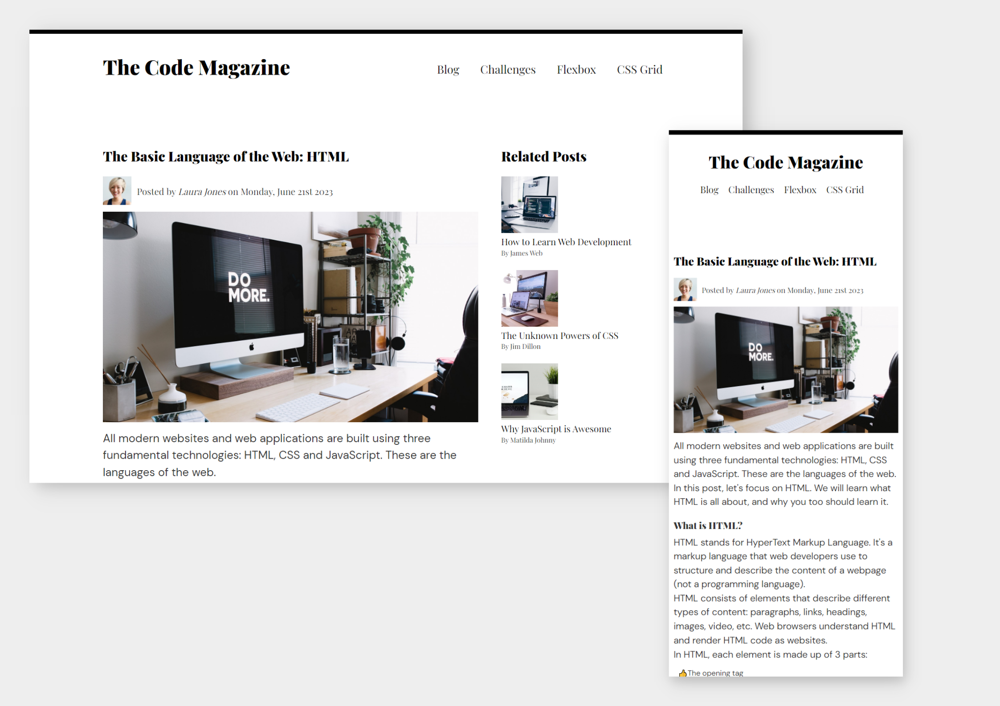

# The Code Magazine

This is a webpage to practice HTML and CSS using Sematics, Floats, Flexbox, and Grid system

## Table of contents

- [Overview](#overview)
  - [Screenshot](#screenshot)
  - [Links](#links)
- [My process](#my-process)
  - [Built with](#built-with)

## Overview

The Code Magazine is a webpage to practice HTML and CSS using Sematics, Floats, Flexbox, and Grid system

### Screenshot

### Links

- Live Site URL: [https://abanoubmokhles.github.io/blog-article/](https://abanoubmokhles.github.io/blog-article/)

## My process

### Built with

- Semantic HTML5 markup
- CSS3
- Floats (main branch)
- Flexbox (flexVersion branch)
- CSS Grid (grid branch)
- BEM Methodology
- Desktop-first workflow
